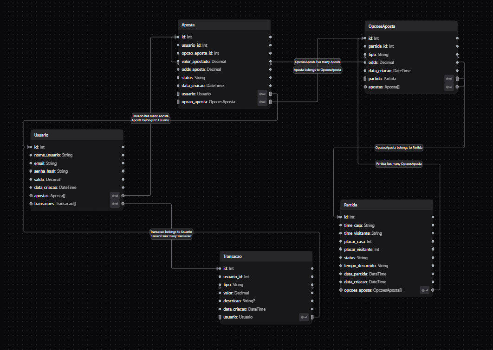

<p align="center">
  
</p>

<h1 align="center">Lista 2 • BetComp</h1>

<p align="center">
  <em>Banco de dados de site de apostas — Projeto da Empresa Júnior Struct (UnB)</em>
</p>

<p align="center">
  <a href="#">
    
  </a>

  <a href="#">
    
  </a>
</p>

---

## Visão Geral

Este repositório contém o **Schema de Banco de Dados** (`schema.prisma`) para a plataforma de apostas BetComp, desenvolvido com **Prisma** e usando **SQLite** localmente.

---

## Schema Prisma 

Abaixo está o print do **`schema.prisma`**, que serviu de base para a criação e população do banco de dados local.

<p align="center">
  
</p>

---

## Tecnologias 

- **Prisma ORM**
- **SQLite**
- **TypeScript**
- **pnpm**

---

## Como rodar (passo a passo)

> Requisitos: **Node 18+** e **pnpm** habilitado.
```bash
# Clonar e Instalar Dependências
git clone https://github.com/artdelpi/lista2_struct.git
cd lista2_struct
pnpm install

# Criar e Aplicar o Schema (Migration)
# Este comando cria o arquivo SQLite (dev.db) e todas as tabelas.
npx prisma migrate dev --name init_models

# Popular o Banco de Dados (Seed)
# Executa o script prisma/seed.ts para inserir os dados iniciais de teste.
npx prisma db seed

# Visualizar e Validar os Dados (Prisma Studio)
# Abre a interface visual em http://localhost:5555.

npx prisma studio
